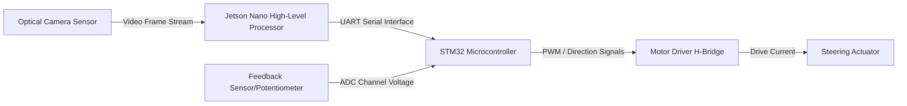

# Technical Guide: Autonomous Lane Detection & Steer-by-Wire System

This report serves as a technical manual for deploying, integrating, and running a real-time lane detection and closed-loop steer-by-wire control system. The system partitions tasks between a high-level processing unit (**Jetson Nano**) running a deep learning model for computer vision and path planning, and a low-level real-time microcontroller (**STM32**) managing actuator control and hardware safety.

---

## 1. System Architecture

The architecture separates heavy computational computer vision tasks from time-critical hardware control. It consists of the following pipeline:



1. **Optical Camera Sensor**: Captures the roadway ahead.
2. **Jetson Nano High-Level Processor**: Resizes and preprocesses the image, executes a convolutional neural network for semantic lane segmentation, calculates the target steering trajectory, and packages control data.
3. **STM32 Microcontroller**: Decodes the control packets over UART, monitors communication frequency for safety timeouts, reads the physical steering wheel feedback via an Analog-to-Digital Converter (ADC), and runs a proportional-integral-derivative (PID) loop to drive the steering motor.

---

## 2. High-Level Processor Pipeline (Jetson Nano)

All source code for the high-level processing unit is located in the [nano/](file:///c:/rvce/helios/lanedetection/nano/) directory.

### A. Segmentation Network Architecture ([net.py](file:///c:/rvce/helios/lanedetection/nano/model/net.py))
The network model is a custom **Tiny U-Net** structure, optimized for real-time edge device inference:
* **Depthwise Separable Convolutions**: Standard convolutions are replaced with depthwise separable layers to reduce memory bandwidth requirements and parameter count by approximately 80%, ensuring high-framerate execution on the Jetson Nano GPU.
* **Skip Connections**: Features from early encoder stages are concatenated with decoder stages to preserve fine-grained spatial details, which is critical for mapping thin lane boundaries.
* **Network Output**: The network accepts $320 \times 180 \times 3$ RGB inputs and outputs a $320 \times 180 \times 1$ probability mask (values from `0.0` to `1.0` indicating lane probability per pixel).

### B. Training Script ([train.py](file:///c:/rvce/helios/lanedetection/nano/model/train.py))
* The training script implements a custom PyTorch dataset with an on-the-fly **Synthetic Road Generator** that simulates curving roadways, camera perspective warps, and lighting noise. This allows training and code verification without requiring external dataset downloads.
* Runs loss optimization combining Binary Cross-Entropy (BCE) and Dice Loss to handle the highly skewed pixel class distribution.

### C. ONNX Export Utility ([export_onnx.py](file:///c:/rvce/helios/lanedetection/nano/model/export_onnx.py))
* Converts PyTorch model weights (`model.pth`) to a static-graph ONNX format (`model.onnx`).
* Static input shapes are enforced ($1 \times 3 \times 180 \times 320$) to enable optimal compilation using Nvidia TensorRT on the Jetson Nano.

---

## 3. Geometric Path Planning & Control Law ([control.py](file:///c:/rvce/helios/lanedetection/nano/inference/control.py))

The path planner converts the raw probability mask into a concrete steering angle command:

1. **Polynomial Lane Fitting**:
   The binary mask is thresholded at `0.5` and split vertically down the middle into left and right halves. The $(x, y)$ coordinate points of both lanes are fitted to 2nd-order polynomial curves:
   $$x = ay^2 + by + c$$
2. **Look-Ahead Target Point**:
   The controller projects ahead to a defined y-coordinate (default $y = 110$, corresponding to $60\%$ down the image plane) and evaluates the polynomials to calculate the lane boundary crossover points: $x_{\text{left}}$ and $x_{\text{right}}$. The target coordinate is the midpoint of these boundary positions:
   $$x_{\text{target}} = \frac{x_{\text{left}} + x_{\text{right}}}{2}$$
   *If one boundary line is lost, a virtual lane boundary is projected at half the nominal road width ($100\text{ pixels}$) from the remaining visible boundary.*
3. **Heading Angle Calculation**:
   A vector is drawn from the bottom center of the image (car camera center $(160, 180)$) to the target point $(x_{\text{target}}, 110)$. The steering angle command ($\theta$) is proportional to the heading angle error ($\alpha$):
   $$\alpha = \arctan2(x_{\text{target}} - 160, 180 - 110)$$
   $$\theta = K_p \cdot \alpha$$
   The output steering angle is limited to a configurable mechanical limit (default $\pm 30.0^\circ$) and converted to a float32 payload.

---

## 4. Low-Level Control Software (STM32)

Embedded C drivers and templates are provided in the [stm32/](file:///c:/rvce/helios/lanedetection/stm32/) directory.

### A. Register and Peripheral Configurations
1. **USART2**: Set to asynchronous mode, `115200` baud, 8-N-1 format. Enable the global interrupt to process incoming UART data without blocking the main CPU loop.
2. **TIM1 PWM**: Configure Channel 1 for PWM output. Adjust the prescaler and auto-reload register depending on your actuator type:
   * **DC Motor (H-Bridge)**: $10\text{kHz} - 20\text{kHz}$ frequency.
   * **RC Servo**: $50\text{Hz}$ frequency (1.0ms to 2.0ms duty cycle pulse width).
3. **ADC1**: Configure Channel 0 to read feedback voltage from the steering shaft's position potentiometer.

### B. Controller Software Logic ([steering_control.c](file:///c:/rvce/helios/lanedetection/stm32/Core/Src/steering_control.c))
* **Packet Parser**: A state-machine parser processes incoming serial bytes. It hunts for start frames (`0xAA 0x55`), validates the command identifier (`0x10`) and length (`4` bytes), extracts the little-endian float32 value, and evaluates the XOR checksum.
* **Safety Watchdog**: If a valid serial packet is not received within **500 ms**, the system sets motor PWM output to zero, preventing runaway steering in the event of camera failure or Jetson software hang.
* **PID Controller**: Runs at a fixed rate of $100\text{Hz}$ using a timer. It calculates the error between the target steering angle and the feedback potentiometer voltage (converted to degrees), computes the proportional, integral (with anti-windup clamping), and derivative terms, and scales the output duty cycle to the motor driver.

---

## 5. Wiring Pinout

| Jetson Nano Pin (J41 Header) | STM32 Microcontroller Pin | Description |
| :--- | :--- | :--- |
| **Pin 8 (TXD)** | **PA3 (USART2 RX)** | Transmits target steering angle |
| **Pin 10 (RXD)** | **PA2 (USART2 TX)** | Receives telemetry feedback (optional) |
| **Pin 14 (GND)** | **GND (Signal Ground)** | Shared common ground reference |

| STM32 Microcontroller Pin | Driver/Sensor Interface | Description |
| :--- | :--- | :--- |
| **PA8 (TIM1 PWM)** | H-Bridge PWM Speed Pin | Speed/torque duty cycle signal |
| **PB0 (GPIO Output)** | H-Bridge Direction Pin | Controls motor direction (Polarity) |
| **PA0 (ADC1 IN0)** | Potentiometer Center Pin | Reads analog feedback voltage |

> [!CAUTION]
> **Voltage Compatibility**: The Jetson Nano operates strictly on **3.3V TTL** levels. The STM32 pins connected to the Jetson J41 header must run on 3.3V logic. Connecting 5V signals directly to the Jetson Nano pins will damage the system.

---

## 6. Deployment Guide: Implementing the Shared Codebase

If you receive this codebase, follow this step-by-step checklist to compile, run, and integrate all elements of the project.

### Phase 1: High-Level Environment Setup (On Laptop or Jetson Nano)
1. **Navigate to project directory**:
   ```bash
   cd lanedetection
   ```
2. **Install Python dependencies**:
   ```bash
   pip install -r nano/requirements.txt
   ```
3. **Train the network on synthetic data**:
   Generate the road simulations and train the network weights:
   ```bash
   python nano/model/train.py
   ```
   *This saves the PyTorch model checkpoint to `nano/model/model.pth`.*
4. **Export the model to ONNX**:
   Convert the PyTorch model to the static ONNX format:
   ```bash
   python nano/model/export_onnx.py
   ```
   *This saves the optimized network graph to `nano/model/model.onnx`.*

### Phase 2: Testing the Python Pipeline Headless
1. **Test with local mock video**:
   Verify that the lane fitting, look-ahead vector, and serial packet packaging work by running the pipeline on a test video file:
   ```bash
   python nano/inference/main.py --video tests/test_video.mp4 --output output.mp4 --no-serial
   ```
   *Verify that `output.mp4` contains the green lane segmentations and look-ahead trajectory overlays.*
2. **Test on laptop camera**:
   Test the optical loop using your laptop's integrated camera:
   ```bash
   python nano/inference/main.py --camera 0 --no-serial --show
   ```

### Phase 3: STM32 Firmware Integration
1. **Setup Project**:
   Create a new project in **STM32CubeIDE** for your specific microcontroller model. Configure the USART2, TIM1, and ADC1 peripherals in the Device Configuration Tool (STM32CubeMX) as described in Section 4A. Keep pin assignments matching your physical board.
2. **Import Drivers**:
   * Copy [steering_control.h](file:///c:/rvce/helios/lanedetection/stm32/Core/Inc/steering_control.h) into the `Core/Inc/` directory.
   * Copy [steering_control.c](file:///c:/rvce/helios/lanedetection/stm32/Core/Src/steering_control.c) into the `Core/Src/` directory.
3. **Update Main Loop and Callbacks**:
   Open `Core/Src/main.c` and copy the integration structure from [main.c](file:///c:/rvce/helios/lanedetection/stm32/Core/Src/main.c):
   * Call `steering_init(&steering_sys)` in the initialization block.
   * Add `HAL_UART_Receive_IT(&huart2, &rx_byte, 1)` to start the UART interrupt.
   * Implement the `HAL_UART_RxCpltCallback` function to feed incoming serial bytes to `steering_parse_byte`.
   * Add the 100Hz controller update loop under the primary `while (1)` loop.
4. **Customize Actuator Hardware Driver**:
   Modify the `steering_set_actuator_hardware` function at the bottom of [steering_control.c](file:///c:/rvce/helios/lanedetection/stm32/Core/Src/steering_control.c) to match your physical motor driver (e.g. mapping to H-Bridge direction pin writes and timber compare registers like `TIM1->CCR1`).
5. **Flash the Board**: Compile and flash the project onto your STM32.

### Phase 4: Full Hardware Integration and Calibration
1. **Establish Connections**: Wire the Jetson Nano J41 Header pins to the STM32 UART pins, and connect the common grounds, motor driver signals, and potentiometer ADC lines according to Section 5.
2. **Start high-level inference**:
   Connect the optical camera sensor to the Jetson Nano and execute the main controller script:
   ```bash
   python nano/inference/main.py --csi --port /dev/ttyTHS1 --baud 115200
   ```
3. **Calibrate steering sensor**:
   Verify that turning the front wheels manually to the center position reads $0.0^\circ$ in the feedback function on the STM32. If not, adjust the scaling offset in `Read_Steering_Feedback_Angle()` inside `main.c`.
4. **Tune PID Loop**:
   Modify `PID_KP`, `PID_KI`, and `PID_KD` inside [steering_control.h](file:///c:/rvce/helios/lanedetection/stm32/Core/Inc/steering_control.h) until the steering actuator tracks the target steering angle smoothly and without oscillations.
